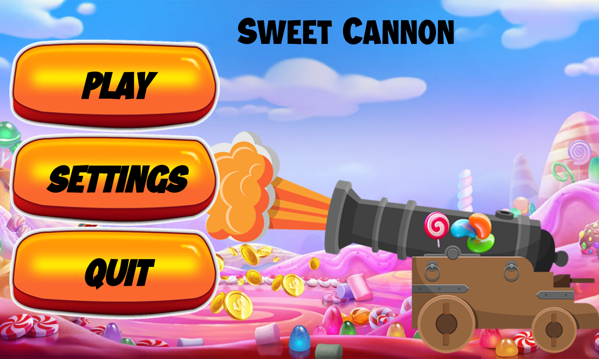
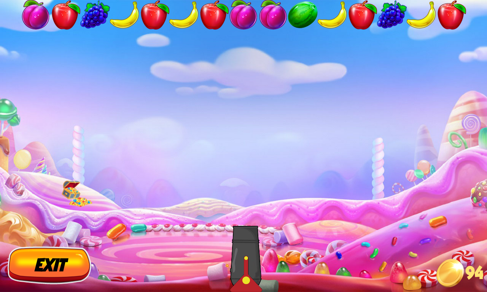
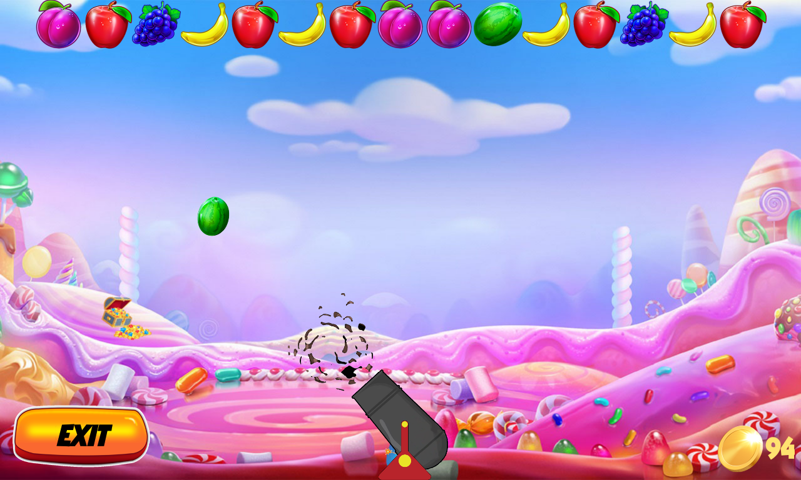
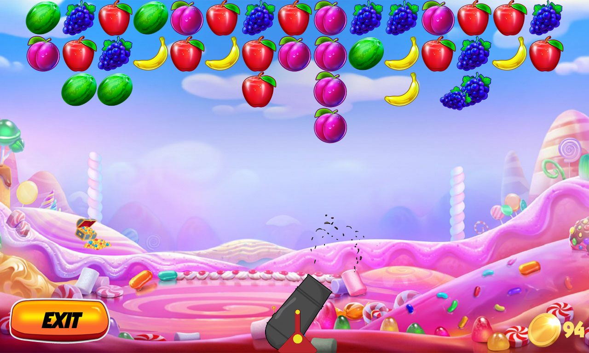

<p align="center"></p>
<h1 align="center">Sweet Cannon</h1>

## Description
<b>EN:</b>

A custom made 2D arcade game. Developed using **Java Android SDK**.

**Sweet Bonanza** casino style game.

<b>UA:</b>

Аркадна 2D гра, створена на замовлення. Розроблена за допомогою **Java Android SDK**.

В стилі казино гри **Sweet Bonanza**.

#
## Screenshots
<p align="center">
  
  
  
  
</p>

#
## Technologies used
<b>EN:</b>
- Creating a 2D game using the **Java Android SDK**
- Work on the **Android** platform
- Working with mathematical game models
- Advanced game settings
- Internal game currency
- Multi streaming
- Save game data

<b>UA:</b>
- Створення 2D гри за допомогою **Java Android SDK**
- Робота на платформі **Android**
- Робота з математичними моделями гри
- Розширені налаштування гри
- Внутрішня ігрова валюта
- Багато потоковість
- Збереження даних гри

#
## License
```
© 2023, CoolOtaku (ericspz531@gmail.com)
```
